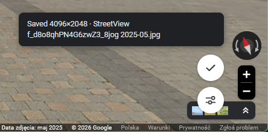
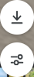
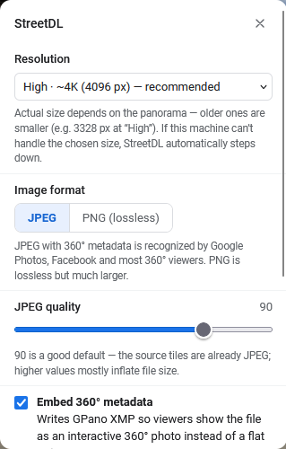

# StreetFox

A Firefox addon that adds a **Download button to Google Street View** and saves the current panorama as a real 360° photo — with embedded [GPano XMP](https://developers.google.com/streetview/spherical-metadata) metadata, so Google Photos, Facebook, Kuula, Pannellum and other viewers show it as an interactive panorama instead of a flat strip.

**No API keys, no accounts, no external services.**

## Features

- One-click download of the current panorama as an equirectangular 360° image
- Works with **historical imagery** — switch the date in Street View, download what you're looking at
- Proper GPano XMP metadata (up to ~16K resolution, JPEG or PNG)
- Customizable file names, quality and resolution
- Works on google.com and 12 local Google Maps domains

## Install

**Temporary (until restart):**

1. Open `about:debugging#/runtime/this-firefox`
2. Click **Load Temporary Add-on…** and pick `manifest.json` from this folder

**Permanent:**

Regular Firefox only installs signed add-ons — either self-sign for free as an unlisted add-on on [addons.mozilla.org](https://addons.mozilla.org/developers/), or use Developer Edition / Nightly / ESR with `xpinstall.signatures.required = false` in `about:config` and install the zip from [Releases](./releases).

## Usage

1. Open [Google Maps](https://www.google.com/maps) and drop into Street View
2. Click the round ⬇ button next to Street View's controls (bottom-right) to download

| | |
|:---:|:---:|
|  |  |
| Download and settings buttons | Settings panel |

## Requirements

- Firefox 115+

## Notes

- Official Street View coverage only; user-contributed photo spheres are not supported.
- Street View imagery is © Google — this tool is for personal use; respect Google's Terms of Service.

## License

[MIT](LICENSE)
